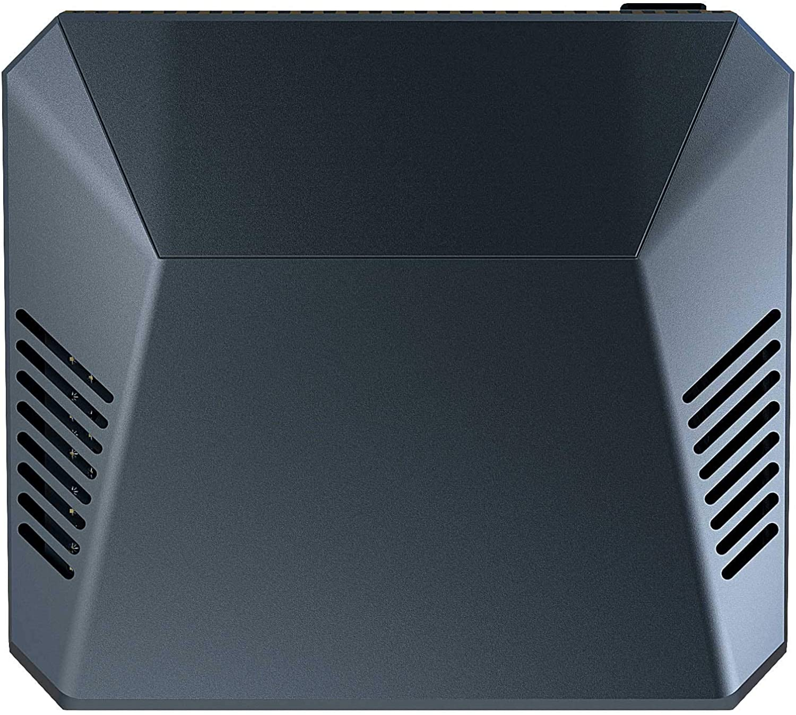
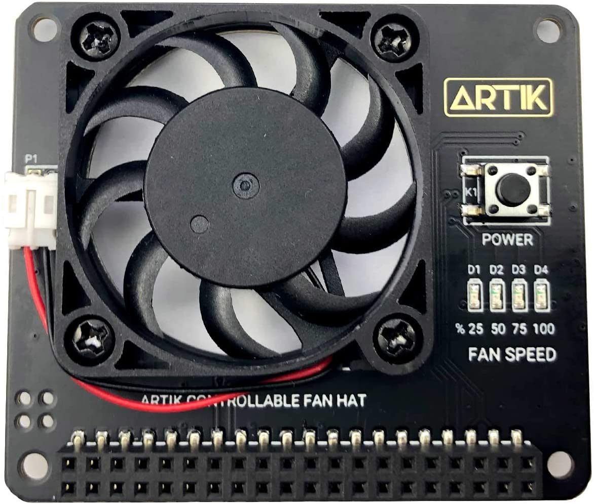

<h1 align="center">
  
  <br />
  Argon Fan Controller
</h1>

<p align="center"><b>Argon Fan HAT / Argon ONE Case Fan Controller for Ubuntu</b></p>
<div align="center"></div>
<p align="center">Made with 💝 for </p>

## Introduction

`argon1.sh` is a refactored version of the Argon FanHAT / Argon ONE Case Fan
controller for Ubuntu and is derived from the origin script published by
[Argon Forty](https://www.argon40.com/) here:

  * <https://download.argon40.com/argon1.sh>

The refactor consisted of: 

  * Adds support for Ubuntu by reading temps from sysfs.
  * Adds support for Ubuntu 20.04 by only using Python 3.
  * Uses [here documents](https://en.wikipedia.org/wiki/Here_document) to make the script easier to read/maintain.
  * Simplifies install/uninstall via an option parser.
  * Removes the config script and desktop icons.

We have a Discord for this project:

  * <https://discord.gg/wG8bAra>

[](https://www.youtube.com/watch?v=b1kG7XUvw5E)

## Installation

This script will only work on [Ubuntu running on a Raspberry Pi](https://ubuntu.com/download/raspberry-pi).

  * Clone the project
    * `git clone https://github.com/wimpysworld/argon1-ubuntu.git`
  * Install the fan controller
    * `cd argon1-ubuntu`
    * `sudo ./argon1-ubuntu --install`

### Usage

```
Usage
  $0 [options]

Available options are
  --config      Get help about how to configure the fan
  --install     Install the Argon ONE Case Fan / Argon FanHAT driver
  --uninstall   Uninstall the Argon ONE Case Fan / Argon FanHAT driver
```

To modify you fan curve edit `/etc/argononed.conf` and then execute
`sudo systemctl restart argononed.service` to made the changes active.

### Argon ONE Pi 4 Power Button Functions

| Power State |     Action    | Function |
|:-----------:|:-------------:|:--------:|
| OFF         | Short Press   | Turn ON|
| ON          | Long Press (>=3s) | Soft Shutdown and Power Cut |
| ON          | Short Press (<=3s) | Nothing |
| ON          | Double Tap    | Reboot |
| ON          | Long Press (>=5s) | Forced Shutdown |

### Argon Fan HAT Power Button Functions

| Power State |     Action    | Function |
|:-----------:|:-------------:|:--------:|
| OFF         | Short Press   | Nothing|
| ON          | Long Press (>=3s) | Soft Shutdown and Power Cut |
| ON          | Short Press (<=3s) | Nothing |
| ON          | Double Tap    | Reboot |
| ON          | Long Press (>=5s) | Forced Shutdown |

## Credits

  * Thanks to [kounch](https://github.com/kounch/) for their [Arch Linux PKGBUILD for Argon One](https://github.com/kounch/argonone).
  * Thanks to [Cédric Meuter](https://github.com/meuter) for their [argon1.sh adapted for Ubuntu 20.04](https://github.com/meuter/argon-one-case-ubuntu-20.04).

## TODO

- [ ] Confirm Argon Fan HAT works on Pi 2, 3 and 4.
- [ ] Replace use of `os.system()`.
- [ ] Clean up parsing of the config file.

## DONE

- [x] Read `/sys/class/thermal/thermal_zone0/temp` in a Pythonic way.
